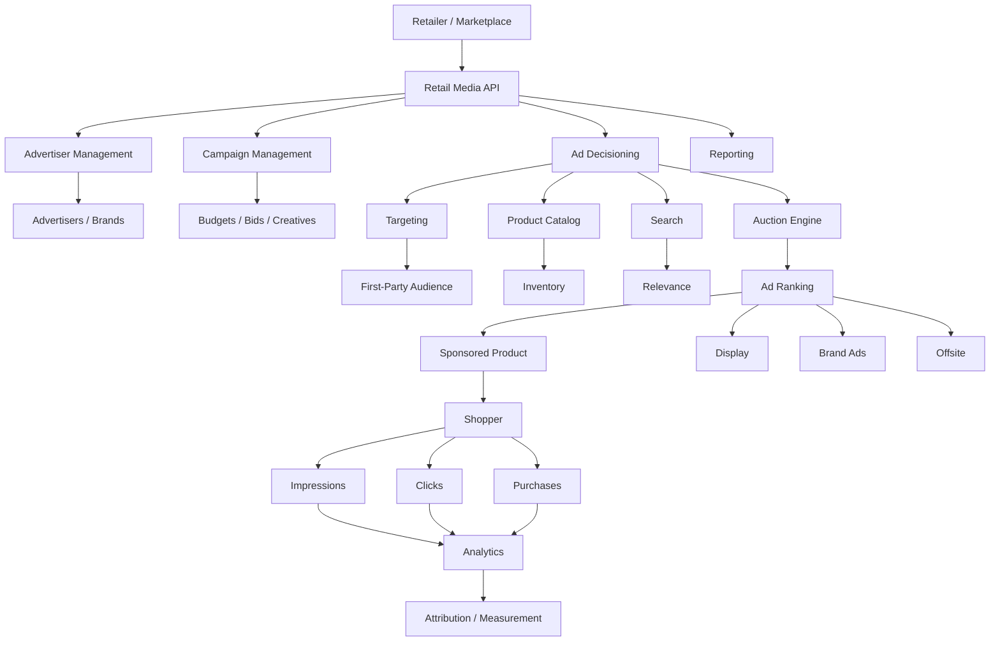
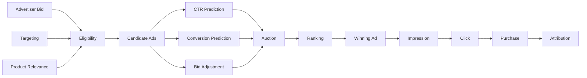
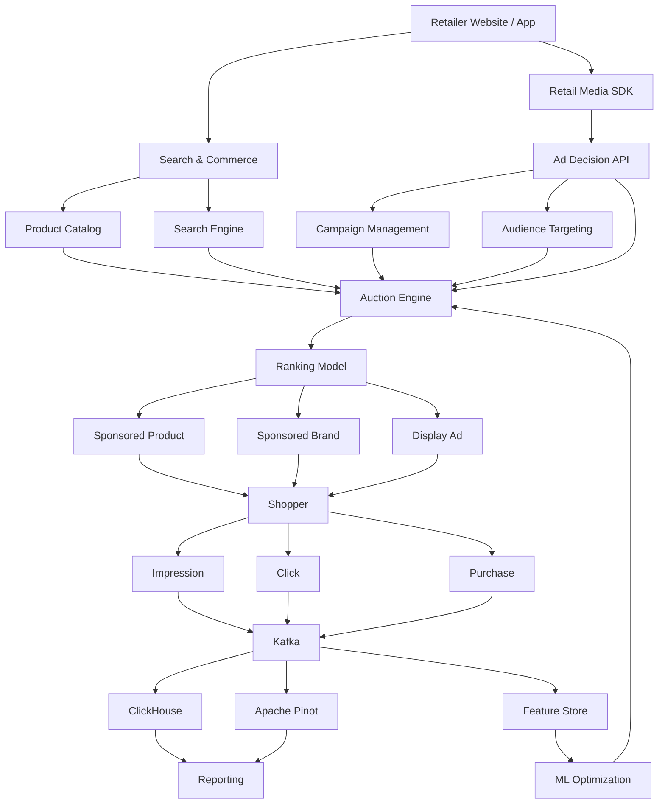

# Awesome-Retail-Media-Network-Platform

# 🛒 Top Retail Media Network Platforms & Open-Source Retail Media Infrastructure


> A curated list of **Retail Media Network (RMN) platforms, commerce media infrastructure, retail advertising APIs, sponsored-product platforms, ad servers, auction engines, audience activation systems and open-source software** for building modern retail media businesses.


Retail Media Networks allow retailers, marketplaces and commerce platforms to monetize their **first-party shopper data, digital inventory and physical retail environments** by enabling brands to advertise close to the point of purchase.


Modern RMNs increasingly span:


* Sponsored Products

* Sponsored Brands

* Sponsored Search

* Onsite Display

* Offsite Advertising

* In-Store Media

* CTV / Video

* Audio

* Retailer Audiences

* Audience Segmentation

* Campaign Management

* Ad Serving

* Real-Time Auctions

* Yield Optimization

* Attribution

* Incrementality

* Measurement

* Billing

* Supplier / Advertiser Portals


This repository focuses primarily on **open-source building blocks for constructing Retail Media Networks**, while maintaining a separate list of commercial platforms such as CitrusAd / Epsilon Retail Media, Criteo Retail Media, PromoteIQ, Kevel, Koddi, Skai, Moloco Commerce Media, Mirakl Ads, Zitcha and other commerce-media platforms.


> **Important:** There is currently no broadly adopted, production-ready open-source platform that is a complete drop-in replacement for a modern enterprise RMN platform. Open-source RMN infrastructure is instead assembled from **ad servers, auction engines, OpenRTB infrastructure, targeting systems, analytics databases, experimentation platforms and commerce/catalog systems**.


---


## 📑 Table of Contents


* [☁️ SaaS/Hosted Platforms](#️-saashosted-platforms)

* [🌍 Open-Source](#-open-source)

* [📢 Open-Source Ad Servers](#-open-source-ad-servers)

* [⚡ Open-Source Ad Auctions & Bidding](#-open-source-ad-auctions--bidding)

* [🔄 Open-Source Header Bidding](#-open-source-header-bidding)

* [🛒 Open-Source Sponsored Product Infrastructure](#-open-source-sponsored-product-infrastructure)

* [🎯 Open-Source Targeting & Audience Infrastructure](#-open-source-targeting--audience-infrastructure)

* [📊 Open-Source Advertising Analytics](#-open-source-advertising-analytics)

* [🧪 Open-Source Experimentation & Attribution](#-open-source-experimentation--attribution)

* [🗃️ Open-Source Commerce & Catalog Infrastructure](#️-open-source-commerce--catalog-infrastructure)

* [📡 Open-Source Event Streaming](#-open-source-event-streaming)

* [🧩 Commercial Platform → Open-Source Equivalent](#-commercial-platform--open-source-equivalent)

* [🏗️ Retail Media Network Architecture](#️-retail-media-network-architecture)

* [🔄 Open-Source RMN Architecture](#-open-source-rmn-architecture)

* [🛒 Sponsored Product Architecture](#-sponsored-product-architecture)

* [⚡ Retail Media Auction Architecture](#-retail-media-auction-architecture)

* [📊 Retail Media Analytics Architecture](#-retail-media-analytics-architecture)

* [⚖️ Commercial vs Open-Source](#️-commercial-vs-open-source)

* [🚀 Recommended Open-Source Stacks](#-recommended-open-source-stacks)

* [📈 Retail Media Metrics](#-retail-media-metrics)

* [🎯 Recommended Projects by Use Case](#-recommended-projects-by-use-case)

* [🏢 Building a Kevel Alternative](#-building-a-kevel-alternative)

* [🛍️ Building an Open-Source Retail Media Network](#️-building-an-open-source-retail-media-network)

* [🌐 Open-Source Retail Media Landscape](#-open-source-retail-media-landscape)

* [🧠 Why Open-Source Retail Media Matters](#-why-open-source-retail-media-matters)

* [🤝 Contributing](#-contributing)

* [⚠️ Disclaimer](#️-disclaimer)


---


# ☁️ SaaS/Hosted Platforms


Commercial RMN platforms provide combinations of ad serving, sponsored listings, campaign management, audience activation, optimization and measurement.


| Platform                                                                                                 | Company    | Primary Focus                        | Key Capabilities                                                                 |

| -------------------------------------------------------------------------------------------------------- | ---------- | ------------------------------------ | -------------------------------------------------------------------------------- |

| [CitrusAd / Epsilon Retail Media](https://www.epsilon.com/us/products-and-services/retail-media-network) | Epsilon    | Retail Media                         | Sponsored products, onsite display, brand pages, offsite activation, measurement |

| [Criteo Retail Media](https://www.criteo.com/solutions/retail-media/)                                    | Criteo     | Commerce Media                       | Retailer monetization, audiences, onsite/offsite advertising, measurement        |

| [PromoteIQ](https://www.promoteiq.com/)                                                                  | Microsoft  | Retail Media                         | Sponsored products, retailer media, campaign management                          |

| [Kevel](https://www.kevel.com/)                                                                          | Kevel      | API-first ad infrastructure          | Ad serving, decisioning, audiences, forecasting, reporting                       |

| [Koddi](https://www.koddi.com/)                                                                          | Koddi      | Commerce Media                       | Sponsored products, retail media, marketplaces, optimization                     |

| [Skai](https://skai.io/retail-media-solutions/)                                                          | Skai       | Retail Media Management              | Cross-retailer campaign management, optimization, measurement                    |

| [Moloco Commerce Media](https://www.moloco.com/commerce-media)                                           | Moloco     | Commerce Media                       | ML-powered advertising, sponsored products, audience optimization                |

| [Mirakl Ads](https://www.mirakl.com/)                                                                    | Mirakl     | Marketplace / Retail Media           | Marketplace monetization and advertising                                         |

| [Zitcha](https://www.zitcha.com/)                                                                        | Zitcha     | Retail Media OS                      | Planning, activation, inventory, optimization, reporting                         |

| [Epsilon Retail Media](https://www.epsilon.com/us/products-and-services/retail-media-network)            | Epsilon    | Full-service RMN                     | Identity, AI-powered data, onsite/offsite media and measurement                  |

| [Topsort](https://www.topsort.com/)                                                                      | Topsort    | Commerce monetization infrastructure | Ad server APIs, auctions, sponsored listings, display, offsite, in-store         |

| [CitrusAd](https://www.citrusad.com/)                                                                    | Epsilon    | Onsite Retail Media                  | Sponsored products, onsite display, brand pages                                  |

| [Amazon Ads](https://advertising.amazon.com/)                                                            | Amazon     | Retail Advertising                   | Sponsored Products, Sponsored Brands, DSP, retail audiences                      |

| [Walmart Connect](https://www.walmartconnect.com/)                                                       | Walmart    | Retail Media                         | Sponsored products, display, offsite, measurement                                |

| [Instacart Ads](https://ads.instacart.com/)                                                              | Instacart  | Commerce Media                       | Sponsored products, display, retail audiences                                    |

| [Roundel](https://roundel.com/)                                                                          | Target     | Retail Media                         | Onsite, offsite, in-store and audience activation                                |

| [Albertsons Media Collective](https://www.albertsonsmediacollective.com/)                                | Albertsons | Retail Media                         | Sponsored products, display, offsite and measurement                             |

| [Carrefour Links](https://www.carrefour.com/en/carrefour-links)                                          | Carrefour  | Retail Media                         | Retailer audiences, onsite/offsite media                                         |

| [Kroger Precision Marketing](https://www.krogerprecisionmarketing.com/)                                  | Kroger     | Retail Media                         | Shopper audiences, sponsored products, measurement                               |


Modern retail media platforms increasingly combine onsite and offsite advertising. Epsilon, for example, describes its current Retail Media platform as combining CitrusAd's onsite capabilities with Epsilon's offsite audience activation.


Criteo similarly combines retail media and broader commerce-media capabilities across retailer inventory, first-party data, audiences and offsite advertising.


---


# 🌍 Open-Source


The open-source RMN ecosystem is **fragmented but highly composable**.


Rather than one giant open-source retail media platform, a retailer can assemble:


```text

                 OPEN-SOURCE RMN

                       │

       ┌───────────────┼────────────────┐

       │               │                │

       ▼               ▼                ▼

    Ad Server        Auction          Analytics

       │               │                │

       ▼               ▼                ▼

 Revive Adserver   Prebid Server     ClickHouse

       │               │             Apache Pinot

       ▼               ▼                │

 Campaigns         Bidding             ▼

 Targeting         OpenRTB         Dashboards

       │               │

       └───────┬───────┘

               ▼

        Retailer Catalog

               │

               ▼

        Sponsored Products

               │

               ▼

        Shopper Experience

```


The key insight is that **general-purpose advertising infrastructure can provide many of the underlying primitives of an RMN**, while the retailer-specific layer adds:


* Product catalog

* Search

* Sponsored ranking

* Retailer inventory

* First-party shopper signals

* SKU-level attribution

* Supplier budgets

* Commerce conversion events


---


# 📢 Open-Source Ad Servers


## Revive Adserver


[Revive Adserver](https://github.com/revive-adserver/revive-adserver) is a mature open-source ad-serving platform.


It provides:


* Campaign management

* Advertiser management

* Ad serving

* Targeting

* Impression tracking

* Click tracking

* Reporting

* Delivery rules


Revive describes itself as an open-source ad-serving system for serving ads, managing advertiser campaigns, targeting users and reporting campaign performance.


| Project                                                               | Description                               | License                   |

| --------------------------------------------------------------------- | ----------------------------------------- | ------------------------- |

| [Revive Adserver](https://github.com/revive-adserver/revive-adserver) | Open-source ad server                     | GPL-2.0-or-later          |

| [Prebid Server](https://github.com/prebid/prebid-server)              | Server-side real-time auctions            | Apache-2.0                |

| [Prebid.js](https://github.com/prebid/Prebid.js)                      | Client-side header bidding                | Apache-2.0                |

| [OpenRTB](https://github.com/InteractiveAdvertisingBureau/openrtb2.x) | RTB protocol implementation/specification | Open-source specification |

| [OpenX Source](https://github.com/openx)                              | Advertising infrastructure ecosystem      | Project-dependent         |


> Revive is not specifically designed for sponsored-product retail search. It is more naturally suited to display advertising and campaign delivery, but can serve as a component inside a broader RMN.


---


# ⚡ Open-Source Ad Auctions & Bidding


## Prebid Server


[Prebid Server](https://github.com/prebid/prebid-server) is an open-source server-side real-time advertising auction platform. It integrates with Prebid.js and Prebid Mobile and is designed for real-time bidding across advertising formats.


```text

Bid Request

    │

    ▼

Prebid Server

    │

    ├── Bidder A

    ├── Bidder B

    ├── Bidder C

    └── Bidder D

    │

    ▼

Auction

    │

    ▼

Winning Bid

```


This makes Prebid Server particularly interesting as an **auction-engine building block**, even though a retail sponsored-product auction requires additional commerce-specific ranking logic.


---


# 🔄 Open-Source Header Bidding


## Prebid.js


[Prebid.js](https://github.com/prebid/Prebid.js) is an open-source library for implementing client-side header bidding.


It supports:


* Multiple demand partners

* Bid collection

* Auction management

* Bid adapters

* Price comparison

* Ad server integration

* Browser-based auctions


Prebid.js is Apache-2.0 licensed and explicitly positioned as an open-source header-bidding library.


```text

Browser

   │

   ▼

Prebid.js

   │

   ├── Bidder A

   ├── Bidder B

   ├── Bidder C

   └── Bidder D

   │

   ▼

Auction

   │

   ▼

Winning Creative

```


For an RMN, the same auction principles can inspire:


* Sponsored-product bidding

* Marketplace ads

* Onsite display

* Offsite inventory

* Supplier-funded promotions


---


# 🛒 Open-Source Sponsored Product Infrastructure


There is **no dominant open-source equivalent to Koddi, CitrusAd or Topsort specifically for sponsored product advertising**.


Instead, a sponsored-product system can be assembled from:


| Layer           | Open-Source Building Block                     |

| --------------- | ---------------------------------------------- |

| Product Catalog | Saleor / Medusa / Vendure                      |

| Search          | OpenSearch / Elasticsearch                     |

| Vector Search   | Qdrant / Weaviate / Milvus                     |

| Auction         | Prebid Server concepts / custom auction engine |

| Ad Serving      | Revive Adserver                                |

| Ranking         | Custom ML / LightGBM / XGBoost                 |

| Event Streaming | Kafka / Redpanda                               |

| Analytics       | ClickHouse / Apache Pinot                      |

| Experimentation | GrowthBook                                     |

| Dashboard       | Metabase / Apache Superset                     |

| API             | FastAPI / Go                                   |

| Database        | PostgreSQL                                     |


A simplified sponsored-product auction:


```text

                 Search Query

                      │

                      ▼

                 Product Search

                      │

                      ▼

               Eligible Products

                      │

                      ▼

              Sponsored Candidates

                      │

          ┌───────────┼───────────┐

          ▼           ▼           ▼

        Bid          CTR        Relevance

          │           │           │

          └───────────┼───────────┘

                      ▼

                Ranking Model

                      │

                      ▼

                Auction / Rank

                      │

                      ▼

              Sponsored Results

```


---


# 🎯 Open-Source Targeting & Audience Infrastructure


Retail media requires first-party audience segmentation.


Useful open-source building blocks include:


| Project                                                        | Role                                   |

| -------------------------------------------------------------- | -------------------------------------- |

| [Apache Unomi](https://github.com/apache/unomi)                | Customer data / personalization        |

| [GrowthBook](https://github.com/growthbook/growthbook)         | Experimentation and feature management |

| [OpenSearch](https://github.com/opensearch-project/OpenSearch) | Search / analytics / filtering         |

| [Apache Spark](https://github.com/apache/spark)                | Large-scale data processing            |

| [Apache Flink](https://github.com/apache/flink)                | Real-time stream processing            |

| [Feast](https://github.com/feast-dev/feast)                    | Feature store                          |

| [MLflow](https://github.com/mlflow/mlflow)                     | ML lifecycle                           |

| [Apache Airflow](https://github.com/apache/airflow)            | Data pipelines                         |

| [dbt Core](https://github.com/dbt-labs/dbt-core)               | Data transformation                    |

| [Keycloak](https://github.com/keycloak/keycloak)               | Identity                               |


A first-party retail audience pipeline can look like:


```text

Purchases

   │

Searches

   │

Clicks

   │

Impressions

   │

Product Views

   │

   ▼

Event Stream

   │

   ▼

Customer Data Platform

   │

   ▼

Audience Segmentation

   │

   ▼

Feature Store

   │

   ▼

Ad Decisioning

```


---


# 📊 Open-Source Advertising Analytics


Retail media generates extremely high-volume event data.


Important events include:


```text

Impression

Click

Search

Product View

Add-to-Cart

Checkout

Purchase

Conversion

Bid

Win

Spend

Revenue

```


## Apache Pinot


[Apache Pinot](https://github.com/apache/pinot) is a real-time distributed OLAP datastore designed for low-latency analytics over large event streams. It supports streaming ingestion such as Kafka and is designed for highly interactive analytics workloads.


It is particularly interesting for RMNs because dashboards may need near-real-time queries such as:


```sql

SELECT

    campaign_id,

    SUM(impressions),

    SUM(clicks),

    SUM(spend),

    SUM(conversions)

FROM ad_events

WHERE event_time >= NOW() - INTERVAL '1' HOUR

GROUP BY campaign_id;

```


---


## ClickHouse


[ClickHouse](https://github.com/ClickHouse/ClickHouse) is an open-source column-oriented analytical database designed for real-time analytical workloads.


It is particularly useful for:


* Campaign analytics

* Attribution

* Clickstream analysis

* ROAS dashboards

* Product-level reporting

* Advertiser reporting

* SKU-level measurement


---


# 📈 Open-Source Analytics Stack


```text

                    Ad Events

                        │

                        ▼

                     Kafka

                        │

              ┌─────────┴─────────┐

              ▼                   ▼

        Apache Pinot          ClickHouse

              │                   │

              └─────────┬─────────┘

                        ▼

                 Analytics API

                        │

              ┌─────────┼─────────┐

              ▼         ▼         ▼

           Metabase   Superset   Grafana

```


---


# 🧪 Open-Source Experimentation & Attribution


Retail media optimization requires constant experimentation.


| Project                                                 | Role                                |

| ------------------------------------------------------- | ----------------------------------- |

| [GrowthBook](https://github.com/growthbook/growthbook)  | A/B testing and feature flags       |

| [PostHog](https://github.com/PostHog/posthog)           | Product analytics / experimentation |

| [OpenPanel](https://github.com/Openpanel-dev/openpanel) | Product analytics                   |

| [Matomo](https://github.com/matomo-org/matomo)          | Web analytics                       |

| [Apache Superset](https://github.com/apache/superset)   | BI / analytics                      |

| [Metabase](https://github.com/metabase/metabase)        | BI / dashboards                     |

| [Grafana](https://github.com/grafana/grafana)           | Observability / dashboards          |


Useful experimentation dimensions include:


```text

Sponsored vs Organic

     │

     ├── CTR

     ├── Conversion Rate

     ├── Revenue

     ├── Basket Size

     └── Incremental Sales

```


---


# 🗃️ Open-Source Commerce & Catalog Infrastructure


Sponsored-product advertising requires a high-quality commerce catalog.


| Project                                                        | Role                    |

| -------------------------------------------------------------- | ----------------------- |

| [Saleor](https://github.com/saleor/saleor)                     | Headless commerce       |

| [Medusa](https://github.com/medusajs/medusa)                   | Commerce infrastructure |

| [Vendure](https://github.com/vendure-ecommerce/vendure)        | Headless commerce       |

| [Spree Commerce](https://github.com/spree/spree)               | E-commerce platform     |

| [OpenSearch](https://github.com/opensearch-project/OpenSearch) | Search                  |

| [Elasticsearch](https://github.com/elastic/elasticsearch)      | Search                  |

| [Meilisearch](https://github.com/meilisearch/meilisearch)      | Search                  |

| [Typesense](https://github.com/typesense/typesense)            | Search                  |

| [Qdrant](https://github.com/qdrant/qdrant)                     | Vector search           |


The commerce catalog provides:


```text

SKU

Product

Brand

Category

Price

Inventory

Margin

Promotion

Attributes

Availability

```


These fields can then become inputs to retail-media ranking.


---


# 📡 Open-Source Event Streaming


Real-time RMNs depend heavily on event pipelines.


| Project                                               | Role                       |

| ----------------------------------------------------- | -------------------------- |

| [Apache Kafka](https://github.com/apache/kafka)       | Event streaming            |

| [Redpanda](https://github.com/redpanda-data/redpanda) | Kafka-compatible streaming |

| [Apache Flink](https://github.com/apache/flink)       | Stream processing          |

| [Apache Spark](https://github.com/apache/spark)       | Batch + stream processing  |

| [Apache Pulsar](https://github.com/apache/pulsar)     | Distributed messaging      |

| [NATS](https://github.com/nats-io/nats-server)        | Lightweight messaging      |


Example:


```text

                    Shopper

                       │

                       ▼

                 Web / Mobile

                       │

       ┌───────────────┼────────────────┐

       ▼               ▼                ▼

     Search          Click           Purchase

       │               │                │

       └───────────────┼────────────────┘

                       ▼

                     Kafka

                       │

              ┌────────┼────────┐

              ▼        ▼        ▼

          Analytics  Audience  ML Models

              │        │        │

              └────────┼────────┘

                       ▼

                  Ad Decision

```


---


# 🧩 Commercial Platform → Open-Source Equivalent


| Commercial Platform                 | Open-Source Equivalent / Building Blocks                                   |

| ----------------------------------- | -------------------------------------------------------------------------- |

| **CitrusAd / Epsilon Retail Media** | Revive + OpenSearch + Kafka + ClickHouse + custom sponsored-product engine |

| **Criteo Retail Media**             | OpenSearch + Kafka + Feast + ClickHouse + custom ad decisioning            |

| **PromoteIQ**                       | Revive + OpenSearch + Kafka + campaign management + custom ranking         |

| **Kevel**                           | Revive + Prebid Server + OpenSearch + ClickHouse + custom decision API     |

| **Koddi**                           | OpenSearch + auction engine + ranking model + ClickHouse                   |

| **Skai**                            | Open-source connectors + campaign service + ClickHouse + Superset          |

| **Moloco Commerce Media**           | Kafka + Feast + MLflow + ranking models + ClickHouse                       |

| **Mirakl Ads**                      | OpenSearch + commerce catalog + auction engine + analytics                 |

| **Zitcha**                          | Kafka + workflow engine + campaign management + ClickHouse + Superset      |

| **Epsilon Retail Media**            | Revive + OpenSearch + audience/CDP layer + analytics                       |

| **Topsort**                         | OpenSearch + custom auction engine + ranking models + Kafka                |

| **Sponsored Product Platform**      | OpenSearch + auction + ranking + ClickHouse                                |

| **Retail Media Ad Server**          | Revive + custom retail targeting layer                                     |

| **Retail Media Analytics Platform** | Kafka + ClickHouse / Pinot + Superset                                      |

| **Commerce Media Platform**         | Catalog + Search + Auction + Audience + Analytics                          |


---


# 🏗️ Retail Media Network Architecture





---


# 🔄 Open-Source RMN Architecture


```text

                         RETAILER

                            │

                            ▼

                    Retail Media API

                            │

       ┌────────────────────┼────────────────────┐

       │                    │                    │

       ▼                    ▼                    ▼

   Campaigns            Advertisers          Catalog

       │                    │                    │

       └────────────────────┼────────────────────┘

                            ▼

                      Ad Decisioning

                            │

              ┌─────────────┼─────────────┐

              ▼             ▼             ▼

          Targeting       Auction      Ranking

              │             │             │

              └─────────────┼─────────────┘

                            ▼

                    Sponsored Products

                            │

                            ▼

                        Shopper

                            │

                  ┌─────────┼─────────┐

                  ▼         ▼         ▼

               Search     Click    Purchase

                  │         │         │

                  └─────────┼─────────┘

                            ▼

                       Event Stream

                            │

                  ┌─────────┼─────────┐

                  ▼         ▼         ▼

             Analytics   Attribution  ML

                  │         │         │

                  └─────────┼─────────┘

                            ▼

                       Optimization

```


---


# 🛒 Sponsored Product Architecture


Sponsored-product advertising is one of the most important RMN use cases.


```text

                         Search Query

                              │

                              ▼

                       Search Engine

                              │

                              ▼

                     Organic Candidates

                              │

                              ▼

                    Sponsored Candidates

                              │

              ┌───────────────┼───────────────┐

              ▼               ▼               ▼

             Bid          Relevance           CTR

              │               │               │

              └───────────────┼───────────────┘

                              ▼

                       Auction / Ranking

                              │

                              ▼

                       Sponsored SKUs

                              │

                              ▼

                         Product Page

                              │

                              ▼

                           Purchase

```


A simplified ranking function could be:


```text

Score =

    Bid

    × Predicted CTR

    × Relevance

    × Quality

    × Availability

    × Business Rules

```


In practice, production systems can use much more sophisticated auction and ranking mechanisms.


---


# ⚡ Retail Media Auction Architecture





---


# 📊 Retail Media Analytics Architecture


```text

                    AD EVENTS

                        │

        ┌───────────────┼────────────────┐

        │               │                │

        ▼               ▼                ▼

    Impression        Click          Conversion

        │               │                │

        └───────────────┼────────────────┘

                        ▼

                      Kafka

                        │

             ┌──────────┴──────────┐

             ▼                     ▼

        ClickHouse             Pinot

             │                     │

             └──────────┬──────────┘

                        ▼

                   Analytics API

                        │

             ┌──────────┼──────────┐

             ▼          ▼          ▼

           BI        Attribution  ML

```


---


# ⚖️ Commercial vs Open-Source


| Capability                    | Commercial RMN Platform | Open-Source Stack          |

| ----------------------------- | ----------------------- | -------------------------- |

| Ad Serving                    | ✅                       | ✅                          |

| Campaign Management           | ✅                       | Build / integrate          |

| Sponsored Products            | ✅                       | Build                      |

| Auction Engine                | ✅                       | Build / Prebid components  |

| Audience Targeting            | ✅                       | Build / integrate          |

| First-Party Data              | ✅                       | ✅                          |

| Product Catalog               | Often integrated        | Integrate                  |

| Search                        | Often integrated        | OpenSearch / Elasticsearch |

| ML Optimization               | ✅                       | Build                      |

| CTR Prediction                | ✅                       | Build                      |

| Conversion Prediction         | ✅                       | Build                      |

| Attribution                   | ✅                       | Build                      |

| Incrementality                | Often integrated        | Build                      |

| Analytics                     | ✅                       | ClickHouse / Pinot         |

| Advertiser Portal             | ✅                       | Build                      |

| Retailer Portal               | ✅                       | Build                      |

| Billing                       | ✅                       | Build                      |

| Offsite Activation            | ✅                       | Integrate                  |

| In-Store Media                | ✅ / varies              | Build                      |

| CTV                           | Often available         | Build / integrate          |

| OpenRTB                       | Often available         | Prebid                     |

| Self Hosting                  | Usually limited         | ✅                          |

| Source Code                   | ❌                       | ✅                          |

| Custom Auction Logic          | Limited / varies        | ✅                          |

| Data Ownership                | Vendor-dependent        | Full control               |

| Vendor Lock-in                | Higher                  | Lower                      |

| Time to Market                | Fast                    | Slower                     |

| Infrastructure Burden         | Low                     | High                       |

| Regulatory / Privacy Controls | Vendor-supported        | Self-managed               |


---


# 📈 Retail Media Metrics


A complete RMN should track multiple layers of metrics.


## Advertising Metrics


| Metric      | Description                   |

| ----------- | ----------------------------- |

| Impressions | Number of ad impressions      |

| Clicks      | Number of clicks              |

| CTR         | Click-through rate            |

| CPC         | Cost per click                |

| CPM         | Cost per thousand impressions |

| CVR         | Conversion rate               |

| CPA         | Cost per acquisition          |

| ROAS        | Return on ad spend            |

| Spend       | Advertising expenditure       |


## Retail Metrics


| Metric           | Description             |

| ---------------- | ----------------------- |

| GMV              | Gross merchandise value |

| AOV              | Average order value     |

| Units Sold       | Product volume          |

| New Customers    | First-time customers    |

| Repeat Customers | Returning customers     |

| Basket Size      | Items / value per order |

| Margin           | Retailer economics      |


## RMN Metrics


| Metric               | Description                               |

| -------------------- | ----------------------------------------- |

| Fill Rate            | Monetized inventory / available inventory |

| Yield                | Revenue generated from inventory          |

| Advertiser Retention | Repeat advertiser activity                |

| Supplier Spend       | Supplier investment                       |

| Media Revenue        | Retailer advertising revenue              |

| Media Margin         | Revenue minus media costs                 |

| Incremental Sales    | Additional sales attributable to media    |

| Incremental ROAS     | ROAS based on incremental sales           |


---


# 🎯 Recommended Projects by Use Case


| Use Case                        | Recommended Starting Point                           |

| ------------------------------- | ---------------------------------------------------- |

| Open-source ad server           | **Revive Adserver**                                  |

| Server-side auctions            | **Prebid Server**                                    |

| Client-side bidding             | **Prebid.js**                                        |

| RTB infrastructure              | **Prebid Server**                                    |

| Search                          | **OpenSearch**                                       |

| Real-time analytics             | **Apache Pinot**                                     |

| Large-scale analytics           | **ClickHouse**                                       |

| Commerce catalog                | **Saleor / Medusa / Vendure**                        |

| Event streaming                 | **Kafka**                                            |

| Stream processing               | **Apache Flink**                                     |

| Audience features               | **Feast**                                            |

| ML lifecycle                    | **MLflow**                                           |

| Experimentation                 | **GrowthBook**                                       |

| BI                              | **Apache Superset / Metabase**                       |

| Customer data / personalization | **Apache Unomi**                                     |

| Workflow                        | **Temporal**                                         |

| API layer                       | **FastAPI / Go**                                     |

| Search analytics                | **OpenSearch**                                       |

| Product search                  | **OpenSearch / Elasticsearch**                       |

| Vector search                   | **Qdrant / Weaviate**                                |

| Ad event analytics              | **ClickHouse / Pinot**                               |

| Full custom RMN                 | **OpenSearch + Kafka + ClickHouse + custom auction** |


---


# 🏢 Building a Kevel Alternative


Kevel is particularly interesting as a reference architecture because its Retail Media Cloud combines ad serving, audience capabilities, forecasting, decisioning and reporting through APIs.


A simplified open-source equivalent could be:


```text

                         RETAILER

                            │

                            ▼

                     Retail Media API

                            │

        ┌───────────────────┼───────────────────┐

        ▼                   ▼                   ▼

    Campaign API        Audience API        Catalog API

        │                   │                   │

        ▼                   ▼                   ▼

   PostgreSQL             Feast             OpenSearch

        │                   │                   │

        └───────────────────┼───────────────────┘

                            ▼

                       Decision API

                            │

                            ▼

                      Auction Engine

                            │

                ┌───────────┼───────────┐

                ▼           ▼           ▼

              Bid          CTR       Relevance

                │           │           │

                └───────────┼───────────┘

                            ▼

                         Ranking

                            │

                            ▼

                      Sponsored Ad

                            │

                            ▼

                        Shopper

```


### Suggested Components


```text

Ad Server          → Revive Adserver

Auction            → Custom / Prebid Server concepts

Search             → OpenSearch

Catalog            → Saleor / Medusa / Vendure

Audience           → Apache Unomi / Feast

Event Streaming    → Kafka

Stream Processing  → Flink

Analytics          → ClickHouse / Pinot

Experimentation    → GrowthBook

ML                  → MLflow

BI                  → Superset / Metabase

API                 → FastAPI / Go

Database            → PostgreSQL

Cache               → Redis

Object Storage      → MinIO

```


---


# 🛍️ Building an Open-Source Retail Media Network


A practical end-to-end system could be structured as:





---


# 🧱 Retail Media Technology Layers


```text

┌────────────────────────────────────────────────────┐

│                 SHOPPER EXPERIENCE                  │

│       Search • Product Pages • Checkout • App      │

└─────────────────────────┬──────────────────────────┘

                          │

┌─────────────────────────▼──────────────────────────┐

│                    AD FORMATS                      │

│ Sponsored Products • Brands • Display • Video     │

└─────────────────────────┬──────────────────────────┘

                          │

┌─────────────────────────▼──────────────────────────┐

│                   AD DECISIONING                   │

│ Targeting • Eligibility • Auctions • Ranking       │

└─────────────────────────┬──────────────────────────┘

                          │

┌─────────────────────────▼──────────────────────────┐

│                  AUDIENCE LAYER                    │

│ First-Party Data • Segments • Features • ML       │

└─────────────────────────┬──────────────────────────┘

                          │

┌─────────────────────────▼──────────────────────────┐

│                  COMMERCE LAYER                    │

│ Catalog • Search • Inventory • Pricing • Margin    │

└─────────────────────────┬──────────────────────────┘

                          │

┌─────────────────────────▼──────────────────────────┐

│                 EVENT PLATFORM                     │

│ Kafka • Flink • Streaming • CDC                    │

└─────────────────────────┬──────────────────────────┘

                          │

┌─────────────────────────▼──────────────────────────┐

│                  DATA / ANALYTICS                  │

│ ClickHouse • Pinot • Superset • Metabase           │

└────────────────────────────────────────────────────┘

```


---


# 🌐 Open-Source Retail Media Landscape


```mermaid

mindmap

  root((Retail Media))

    Ad Serving

      Revive Adserver

      Custom Ad Server

    Auctions

      Prebid Server

      OpenRTB

      Custom Auction Engine

    Header Bidding

      Prebid.js

      Prebid Server

    Search

      OpenSearch

      Elasticsearch

      Meilisearch

      Typesense

    Commerce

      Saleor

      Medusa

      Vendure

      Spree

    Audience

      Apache Unomi

      Feast

      Spark

      Flink

    Analytics

      ClickHouse

      Apache Pinot

      Superset

      Metabase

      Grafana

    Experimentation

      GrowthBook

      PostHog

      Matomo

    ML

      MLflow

      XGBoost

      LightGBM

      Feast

    Streaming

      Kafka

      Redpanda

      Flink

      Pulsar

    Infrastructure

      PostgreSQL

      Redis

      MinIO

      Kubernetes

    Applications

      Sponsored Products

      Sponsored Brands

      Display

      Offsite

      In-Store

      CTV

```


---


# 🔥 Open-Source RMN Reference Stack


A strong general-purpose architecture:


```text

                       RETAILER

                          │

                          ▼

                  Retail Media API

                          │

       ┌──────────────────┼──────────────────┐

       │                  │                  │

       ▼                  ▼                  ▼

   Campaigns          Audience             Catalog

       │                  │                  │

       ▼                  ▼                  ▼

 PostgreSQL             Feast            OpenSearch

       │                  │                  │

       └──────────────────┼──────────────────┘

                          ▼

                    Auction Engine

                          │

                ┌─────────┼─────────┐

                ▼         ▼         ▼

               Bid       CTR      Relevance

                │         │         │

                └─────────┼─────────┘

                          ▼

                       Ranking

                          │

                          ▼

                  Sponsored Product

                          │

                          ▼

                       Shopper

                          │

                          ▼

                        Kafka

                          │

             ┌────────────┼────────────┐

             ▼            ▼            ▼

        ClickHouse      Pinot        MLflow

             │

             ▼

        Superset / Metabase

```


---


# 🧩 Example Sponsored-Product API


A retailer could expose a simple API:


```text

POST /v1/ads/search

```


Request:


```json

{

  "query": "running shoes",

  "placement": "search_results",

  "user_id": "user_123",

  "limit": 5

}

```


Internally:


```text

Query

  │

  ▼

Search

  │

  ▼

Candidate SKUs

  │

  ▼

Eligible Campaigns

  │

  ▼

Targeting

  │

  ▼

Auction

  │

  ▼

ML Ranking

  │

  ▼

Sponsored Results

```


Response:


```json

{

  "ads": [

    {

      "product_id": "sku_123",

      "campaign_id": "campaign_456",

      "position": 1,

      "bid": 1.25

    }

  ]

}

```


---


# 🧠 Why Open-Source Retail Media Matters


Retail media platforms increasingly become part of a retailer's core technology stack.


An open architecture can provide:


* Control over auction logic

* Control over ranking models

* Control over first-party data

* Custom ad formats

* Custom targeting

* Custom attribution

* Lower vendor lock-in

* Data portability

* Self-hosting

* Air-gapped deployment

* Integration with existing commerce systems

* Integration with retailer loyalty data

* Custom margin optimization

* Custom ML models


The strongest argument for open source is not necessarily replacing every commercial component.


Instead, it is creating a **composable Retail Media OS**:


```text

             RETAILER DATA

                   │

                   ▼

             YOUR DATA LAYER

                   │

          ┌────────┼────────┐

          ▼        ▼        ▼

       Catalog  Audience  Events

          │        │        │

          └────────┼────────┘

                   ▼

             YOUR AUCTION

                   │

                   ▼

            YOUR RANKING

                   │

                   ▼

             YOUR AD SERVER

                   │

                   ▼

             YOUR ANALYTICS

                   │

                   ▼

             YOUR REVENUE

```


There is currently no broadly adopted open-source RMN equivalent that provides the entire commercial stack out of the box; the practical open-source strategy is therefore **composability**. General-purpose ad servers such as Revive and real-time auction infrastructure such as Prebid provide important primitives, while the retail-specific sponsored-product, catalog, targeting and measurement layers generally need to be built or integrated.


---


# 🤝 Contributing


Contributions are welcome!


Please consider adding:


* Retail Media Networks

* Commerce Media Platforms

* Sponsored Product platforms

* Sponsored Search platforms

* Retail Ad Servers

* OpenRTB implementations

* Auction engines

* Header-bidding systems

* Open-source ad servers

* Audience platforms

* CDPs

* Customer segmentation systems

* Retail search engines

* Commerce platforms

* Product catalogs

* Attribution platforms

* Incrementality tools

* Advertising analytics systems

* Event-streaming systems

* ML ranking systems

* Retail media dashboards

* In-store advertising infrastructure

* CTV / video advertising infrastructure

* Open-source RMN projects


When adding a project, distinguish carefully between:


* **Fully open-source**

* **Open-core**

* **Source available**

* **Open-source library**

* **Commercial platform built on open-source**

* **Hosted service built around open-source**

* **Research prototype**


Do not label a proprietary retail media platform as open source simply because it exposes APIs or integrates with open-source technologies.


---


# ⚠️ Disclaimer


This repository is an independent technical curation and is **not affiliated with or endorsed by any company or project listed here**.


Retail media infrastructure combines advertising technology with commerce infrastructure, first-party data and retailer operations.


Open-source software can provide many of the technical building blocks, including:


* Ad serving

* Auctions

* Search

* Targeting

* Analytics

* Event streaming

* ML

* Experimentation

* Catalog management

* APIs


However, software alone does not provide:


* Retailer advertiser relationships

* Supplier contracts

* First-party shopper data

* Retail inventory

* Closed advertising demand

* Payment relationships

* Brand sales teams

* Measurement partnerships

* Privacy/legal compliance

* Retail media operations


Advertising and privacy regulations also vary by jurisdiction. Always review applicable privacy, consent, data-sharing and advertising requirements before deploying a retail media system.


Licensing can also differ between projects and dependencies. Always verify the current license and commercial-use terms before deployment.


---


## ⭐ Star This Repository


If you are interested in:


* Retail Media Networks

* Commerce Media

* Sponsored Products

* Sponsored Search

* Retail Advertising

* AdTech

* OpenRTB

* Advertising Auctions

* First-Party Data

* Commerce Infrastructure

* Open-Source AdTech

* Retail Technology

* Digital Advertising


consider giving this repository a ⭐ **Star** and contributing new projects.


---


**Last updated: September 2026**
